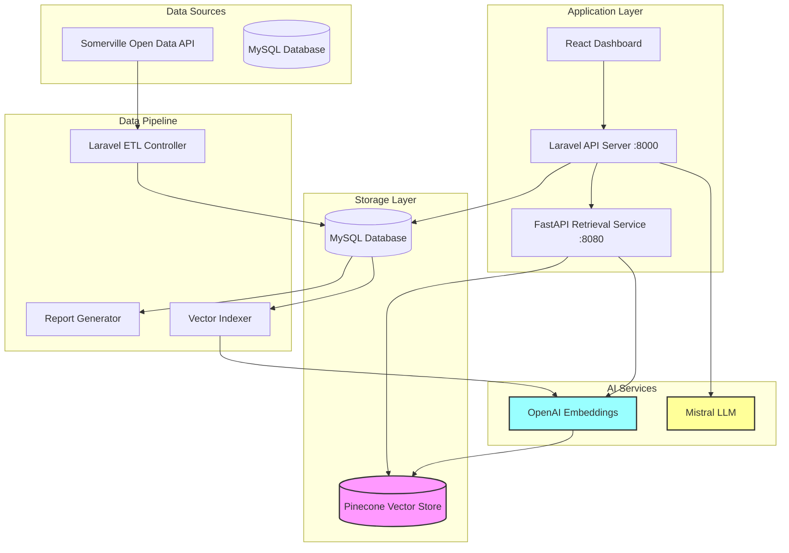
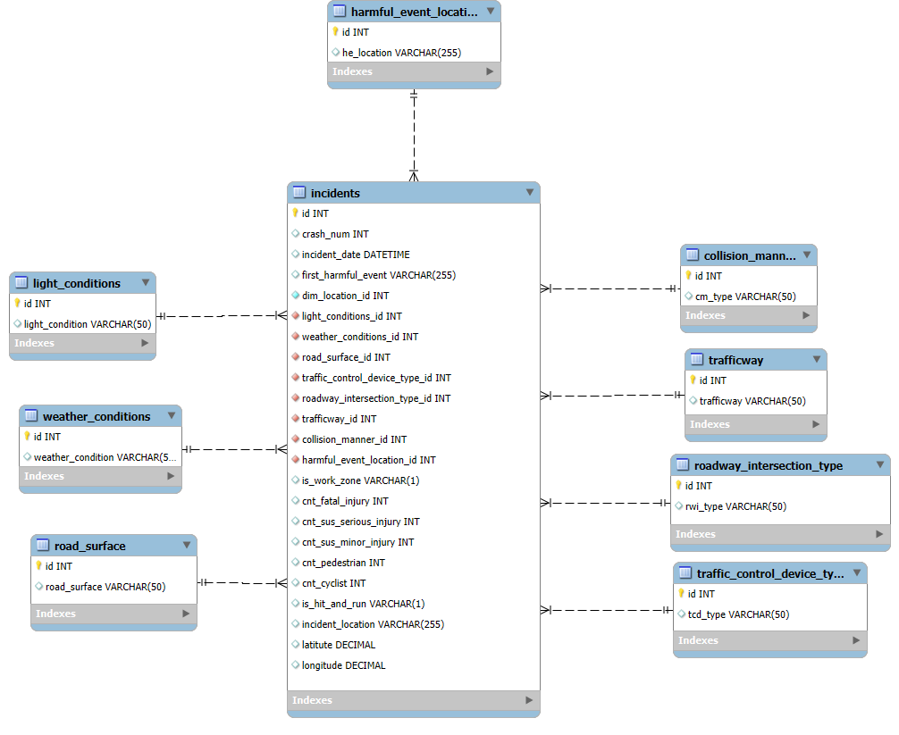
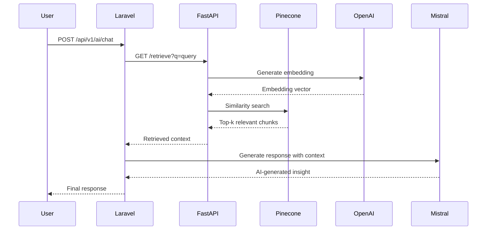
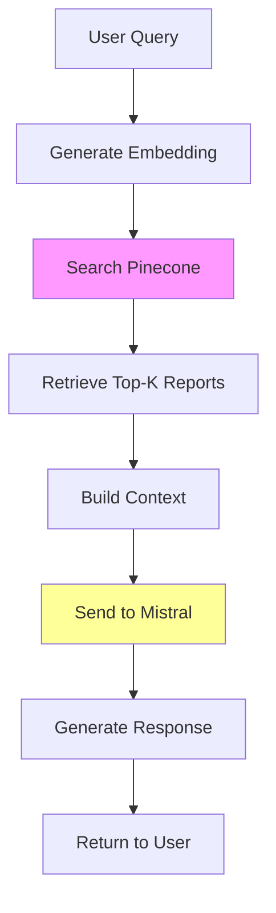
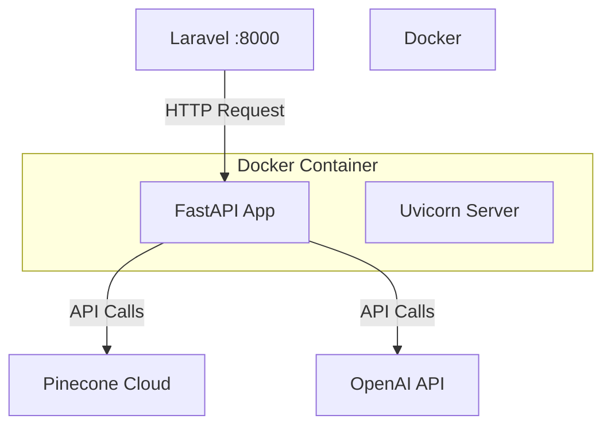

# Crash Incident Analysis System

A comprehensive crash incident analysis platform combining traditional data analytics with RAG (Retrieval Augmented Generation) for intelligent insights and AI-powered reporting.

## Architecture Overview



## System Components

### 1. Data Layer
- **MySQL Database**: Stores structured incident data with normalized dimensions
- **Pinecone Vector Store**: Stores vector embeddings of pre-generated reports for semantic search

### 2. Backend Services
- **Laravel API (Port 8000)**: Main application server handling data management and AI orchestration
- **FastAPI Service (Port 8080)**: Dedicated retrieval service for RAG pipeline

### 3. AI Services
- **OpenAI**: Used exclusively for generating embeddings during indexing and retrieval
- **Mistral AI**: Powers the conversational AI for generating insights and answering queries

## Database Schema



The database follows a star schema design with:
- **Fact Table**: `incidents` - Core incident records
- **Dimension Tables**: Weather conditions, light conditions, collision types, etc.
- **View**: `incidents_view` - Denormalized view for analytics

## Setup Instructions

### Prerequisites
- PHP 8.1+
- Python 3.11+
- MySQL 8.0+
- Docker & Docker Compose
- Composer
- pip

### 1. Environment Configuration

Create a `.env` file in the root directory:

```env
# Database
DB_CONNECTION=mysql
DB_HOST=127.0.0.1
DB_PORT=3306
DB_DATABASE=your_database
DB_USERNAME=root
DB_PASSWORD=your_password

# AI Services
MISTRAL_API_KEY=your_mistral_key
OPENAI_API_KEY=your_openai_key
PINECONE_API_KEY=your_pinecone_key
PINECONE_INDEX_NAME=crash-incidents
```

### 2. Install Dependencies

```bash
# Install Laravel dependencies
composer install

# Install Python dependencies
pip install -r requirements.txt
```

### 3. Database Setup

```bash
# Run migrations
php artisan migrate

# Load initial data
curl -X POST http://localhost:8000/api/v1/load
```

### 4. Generate Pre-computed Reports (Independent Workflow)

Run the report generation notebook to create incident summaries:

```bash
jupyter notebook py-scripts/report.ipynb
```

This notebook:
- Connects to MySQL database
- Generates detailed reports for each incident
- Stores reports back in the database

**Note**: This is independent of vector indexing and can be run separately to regenerate reports.

### 5. Index Data into Vector Store (Independent Workflow)

Run the indexing pipeline to create embeddings:

```bash
jupyter notebook py-scripts/indexing-pipeline.ipynb
```

This notebook:
- Retrieves pre-generated reports from MySQL
- Uses OpenAI embeddings (text-embedding-3-small)
- Indexes into Pinecone vector store
- Creates semantic search capability

**Note**: Run this after generating reports to enable RAG functionality.

### 6. Start Services

```bash
# Start FastAPI retrieval service
docker-compose up -d

# Start Laravel server
php artisan serve
```

## API Endpoints

### Data Management APIs

#### `GET /api/v1/incidents`
Fetches all incidents from the `incidents_view`.

**Response:**
```json
{
  "success": true,
  "data": [...]
}
```

**Purpose**: Provides complete incident dataset for dashboard visualization and filtering.

---

#### `POST /api/v1/load`
Loads and processes data from Somerville Open Data API.

**Purpose**: ETL endpoint that:
- Fetches raw data from external API
- Normalizes and loads dimension tables
- Creates incident fact records
- Returns loading statistics

**Response:**
```json
{
  "success": true,
  "counts": {
    "light_conditions": 5,
    "weather_conditions": 8,
    "incidents": 1234
  }
}
```

---

#### `GET /api/v1/dashboard`
Returns pre-computed analytics and metrics.

**Response:**
```json
{
  "success": true,
  "data": {
    "summary": {...},
    "by_weather": [...],
    "monthly_trends": [...],
    "geo_points": [...]
  }
}
```

**Purpose**: Provides aggregated statistics for dashboard visualizations without client-side computation.

---

### AI-Powered APIs

#### `POST /api/v1/ai/chat`
Handles AI-powered conversations and insights.

**Request:**
```json
{
  "question": "Explain the trend in accidents",
  "data": [...],
  "mode": "report|qa",
  "isFollowUp": false,
  "conversationHistory": []
}
```

**Architecture Flow:**


**Purpose**: 
- **Report Mode**: Generates comprehensive analytical reports
- **QA Mode**: Answers specific questions with data context
- Supports follow-up conversations with history

---

### FastAPI Retrieval Service

#### `GET :8080/retrieve`
Semantic search endpoint for RAG pipeline.

**Query Parameters:**
- `q` (required): Search query
- `k` (optional, default=5): Number of results

**Response:**
```json
{
  "query": "accidents in work zones",
  "k": 5,
  "results": [
    {
      "content": "Report text...",
      "metadata": {
        "incident_id": 123,
        "crash_num": "ABC123",
        "incident_date": "2024-01-15"
      }
    }
  ]
}
```

**Purpose**: 
- Converts queries to embeddings using OpenAI
- Performs similarity search in Pinecone
- Returns relevant incident reports as context
- Enables RAG by providing grounded context to LLM

---

#### `GET :8080/health`
Health check endpoint.

**Purpose**: Monitors service availability for container orchestration.

## RAG Pipeline Explained

### Why RAG?

Traditional LLMs have limitations:
- No access to specific incident data
- May hallucinate facts
- Cannot provide grounded, verifiable insights

RAG (Retrieval Augmented Generation) solves this by:
1. **Retrieving** relevant context from our vector store
2. **Augmenting** the LLM prompt with factual data
3. **Generating** accurate, grounded responses

### How It Works



### Why OpenAI vs Mistral?

- **OpenAI (`text-embedding-3-small`)**: Used for embeddings only
  - High-quality semantic representations
  - Consistent embedding space
  - Cost-effective for retrieval
  
- **Mistral (`mistral-small-2506`)**: Used for text generation
  - Excellent reasoning capabilities
  - Strong analytical skills
  - Better for conversational AI

## Docker Architecture

### FastAPI Container

The retrieval service runs in an isolated container:



**Benefits:**
- Isolation from main application
- Easy scaling
- Independent deployment
- Consistent environment

### Container Configuration

**Dockerfile**: Builds lightweight Python 3.11 container with FastAPI
**docker-compose.yml**: Orchestrates service with environment variables and port mapping

## Development Workflow

### Quick Start

```bash
# Setup everything (database, dependencies, initial data)
composer run setup

# Start development servers (Laravel + FastAPI Docker container)
composer run dev
```

### What `composer run setup` does:
- Installs PHP and Node dependencies
- Runs database migrations
- Loads initial data from Somerville API
- Generates application key
- Builds and starts Docker container

### What `composer run dev` does:
- Starts Laravel development server on port 8000
- Ensures FastAPI Docker container is running on port 8080
- Enables hot-reload for development